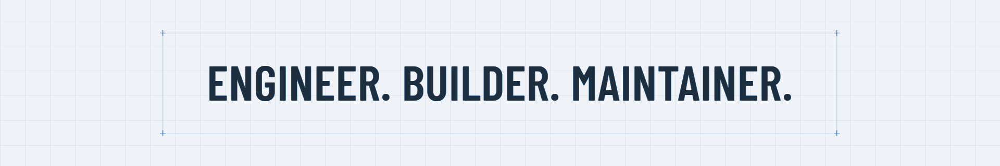

<picture>
  <source media="(prefers-color-scheme: dark)" srcset="assets/brand/github-1920x320.png">
  <source media="(prefers-color-scheme: light)" srcset="assets/brand/github-light-1920x320.png">
  
</picture>

**I build open-source guardrails for software delivery — linting, commit standards, and CI/CD automation.**

I maintain [cpp-linter][cpp-linter], and run two small product lines on the same principle: [keelinfra][keelinfra] (self-hosted Keycloak for production) and [keelapps][keelapps] (admin tools for Jira and Confluence). To support the open-source work, [sponsor me][sponsors]; to get help running Keycloak, see [keelinfra services][keelinfra-pricing].

[About][about] · [Blog][blog] · [RSS][rss] · [X][x] · [WeChat][qrcode]

## Flagship

**[cpp-linter][cpp-linter]** [][cpp-linter-action]
[][cpp-linter-pypi]
[][clang-tools-pypi] 
clang-format and clang-tidy on every pull request, posted back as inline review comments. Ships as a [GitHub Action][cpp-linter-action], a [pre-commit hook][cpp-linter-hooks], and a [Python package][cpp-linter-pypi], with pinned clang tool versions on Linux, macOS, and Windows.

More than 1000 public repositories run it in CI, including projects from:

   <b>Apache</b>&nbsp;&nbsp;
   <b>Bloomberg</b>&nbsp;&nbsp;
   <b>Qualcomm</b>&nbsp;&nbsp;
   <b>Samsung</b>&nbsp;&nbsp;
   <b>Nextcloud</b>&nbsp;&nbsp;
   <b>Jupyter</b>

→ [Who else uses it][cpp-linter-showcase]

## Products

**[keelinfra][keelinfra]** — self-hosted Keycloak you can run in production 
An Apache-2.0 [distribution][keelinfra-keycloak] with HA, backups and point-in-time recovery, monitoring, and upgrade paths re-tested nightly in public CI. Free to run yourself; [subscriptions and fixed-scope services][keelinfra-pricing] for teams that want someone to call.

**[keelapps][keelapps]** — admin tools for Jira and Confluence Cloud 
Permission audits, recurring tasks, scheduled reports, page approvals. Built on Atlassian Forge, so each app runs inside your own tenant. Available on the [Atlassian Marketplace][keelapps-marketplace].

**[Keelhaven][keelhaven]** — Mac backup to storage you own 
A native menu bar app over restic: files are encrypted on your Mac before they leave it. Free and open source — no subscription, no telemetry.

<b>More open source</b> — commit-check, Conventional Branch, Open Delivery Spec, Jenkins plugins

 

- **[commit-check][commit-check]** — enforce commit message, branch naming, and AI-attribution rules, in CI or as a pre-commit hook.
- **[Conventional Branch][conventional-branch]** — a naming specification for Git branches, with a JSON Schema and conformance fixtures. Lives at [conventionalbranch.org](https://conventionalbranch.org).
- **[Open Delivery Spec][ods]** — machine-parseable schemas for delivery governance: what was built, tested, reviewed, and deployed, as evidence a machine can check. [spec][ods-spec] · [cli][ods-cli] · [validate-action][ods-validate-action]
- **Jenkins** — [explain-error-plugin][explain-error-plugin] (AI diagnosis of build failures) and [jenkinsfilelint][jenkinsfilelint].
- Also [gitstats][gitstats] and [mkdocs-ng][mkdocs]. Contributor to [Python][python-prs] and [PyPA][pypa-prs].

## Writing

<!-- BLOG-POST-LIST:START -->
- [Keelhaven Releases New Version—This Time, Updates Come from Real User Feedback](https://shenxianpeng.github.io/en/posts/2026/keelhaven-0-8-0/) - Sep 9, 2026
- [mkdocs-ng v1.8.0 Released — Upstream Issues Fixed, Builds ~14% Faster](https://shenxianpeng.github.io/en/posts/2026/mkdocs-ng-1.8/) - Aug 13, 2026
- [Open Delivery Spec update: AI code shouldn&#39;t just pass the gate — it should leave evidence](https://shenxianpeng.github.io/en/posts/2026/open-delivery-spec-update/) - Aug 8, 2026<!-- BLOG-POST-LIST:END -->

→ **[More on my blog][blog]**. Follow along in English on **[X][x]** or by **[RSS][rss]**. 中文读者请关注公众号 **[沈显鹏][qrcode]**。

[about]: https://shenxianpeng.github.io/en/about/
[x]: https://x.com/xianpengshen
[blog]: https://shenxianpeng.github.io/en/posts/
[rss]: https://shenxianpeng.github.io/en/index.xml
[qrcode]: https://github.com/shenxianpeng/blog/blob/main/assets/img/qrcode.jpg
[sponsors]: https://github.com/sponsors/shenxianpeng
[cpp-linter]: https://github.com/cpp-linter
[cpp-linter-action]: https://github.com/cpp-linter/cpp-linter-action
[cpp-linter-hooks]: https://github.com/cpp-linter/cpp-linter-hooks
[cpp-linter-pypi]: https://pypi.org/project/cpp-linter/
[clang-tools-pypi]: https://pypi.org/project/clang-tools/
[cpp-linter-showcase]: https://cpp-linter.github.io/showcase/
[keelinfra]: https://keelinfra.io
[keelinfra-keycloak]: https://github.com/keelinfra/keycloak
[keelinfra-pricing]: https://keelinfra.io/pricing/
[keelapps]: https://keelapps.app
[keelapps-marketplace]: https://marketplace.atlassian.com/vendors/1003432963/keelapps
[keelhaven]: https://keelhaven.app
[commit-check]: https://github.com/commit-check/commit-check
[conventional-branch]: https://github.com/conventional-branch/conventional-branch
[explain-error-plugin]: https://github.com/jenkinsci/explain-error-plugin
[jenkinsfilelint]: https://github.com/jenkinsci/jenkinsfilelint
[gitstats]: https://github.com/shenxianpeng/gitstats
[mkdocs]: https://github.com/mkdocs-ng/mkdocs
[ods]: https://github.com/open-delivery-spec
[ods-spec]: https://github.com/open-delivery-spec/spec
[ods-cli]: https://github.com/open-delivery-spec/cli
[ods-validate-action]: https://github.com/open-delivery-spec/validate-action
[pypa-prs]: https://github.com/search?q=is%3Apr+author%3Ashenxianpeng+is%3Amerged+user%3Apypa&type=pullrequests
[python-prs]: https://github.com/search?q=is%3Apr+author%3Ashenxianpeng+is%3Amerged+user%3Apython&type=pullrequests
