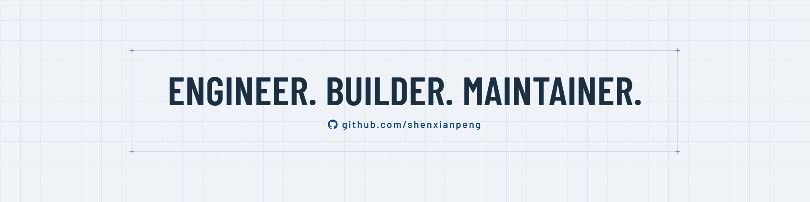

<picture>
  <source media="(prefers-color-scheme: dark)" srcset="assets/brand/generic-1920x480.png">
  <source media="(prefers-color-scheme: light)" srcset="assets/brand/generic-light-1920x480.png">
  
</picture>

**I build open-source tools that make software delivery verifiable.**

Linting, commit and branch standards, and machine-readable evidence from commit to deploy — increasingly with AI in the loop.

[About][about] · [Blog][blog] · [RSS][rss] · [X][x] · [WeChat][qrcode]

## Projects

**[cpp-linter-action][cpp-linter-action]** [][cpp-linter-action] 
clang-format and clang-tidy on every pull request, posted back as inline review comments.

**[Conventional Branch][conventional-branch]** [][conventional-branch] 
A naming specification for Git branches, with a JSON Schema and conformance fixtures. Lives at **[conventionalbranch.org](https://conventionalbranch.org)**.

**[commit-check][commit-check]** [][commit-check] 
Enforce commit message, branch naming, and AI-attribution rules — in CI or as a pre-commit hook.

**[Open Delivery Spec][ods]** — what I'm building now 
Machine-parseable schemas for delivery governance: what was built, tested, reviewed, and deployed, as evidence a machine can check. [spec][ods-spec] · [cli][ods-cli] · [validate-action][ods-validate-action]

## Elsewhere

Also maintaining [cpp-linter-hooks][cpp-linter-hooks], [explain-error-plugin][explain-error-plugin] (AI diagnosis of Jenkins failures), [jenkinsfilelint][jenkinsfilelint], [gitstats][gitstats], and [mkdocs-ng][mkdocs]. Contributor to [Python][python-prs] and [PyPA][pypa-prs].

## Writing

<!-- BLOG-POST-LIST:START -->
- [mkdocs-ng v1.8.0 Released — Upstream Issues Fixed, Builds ~14% Faster](https://shenxianpeng.github.io/en/posts/2026/mkdocs-ng-1.8/) - Aug 13, 2026
- [Open Delivery Spec update: AI code shouldn&#39;t just pass the gate — it should leave evidence](https://shenxianpeng.github.io/en/posts/2026/open-delivery-spec-update/) - Aug 8, 2026
- [From Praising to Bashing—My Attitude Shift Towards GitHub Copilot](https://shenxianpeng.github.io/en/posts/2026/goodbye-copilot/) - Jul 20, 2026<!-- BLOG-POST-LIST:END -->

→ **[More on my blog][blog]**, or follow on WeChat **[shenxianpeng][qrcode]** for AI + DevOps notes in Chinese.

[about]: https://shenxianpeng.github.io/en/about/
[x]: https://x.com/xianpengshen
[blog]: https://shenxianpeng.github.io/en/posts/
[rss]: https://shenxianpeng.github.io/index.xml
[qrcode]: https://github.com/shenxianpeng/blog/blob/main/assets/img/qrcode.jpg
[cpp-linter-action]: https://github.com/cpp-linter/cpp-linter-action
[cpp-linter-hooks]: https://github.com/cpp-linter/cpp-linter-hooks
[commit-check]: https://github.com/commit-check/commit-check
[conventional-branch]: https://github.com/conventional-branch/conventional-branch
[explain-error-plugin]: https://github.com/jenkinsci/explain-error-plugin
[jenkinsfilelint]: https://github.com/jenkinsci/jenkinsfilelint
[gitstats]: https://github.com/shenxianpeng/gitstats
[mkdocs]: https://github.com/mkdocs-ng/mkdocs
[ods]: https://github.com/open-delivery-spec
[ods-spec]: https://github.com/open-delivery-spec/spec
[ods-cli]: https://github.com/open-delivery-spec/cli
[ods-validate-action]: https://github.com/open-delivery-spec/validate-action
[pypa-prs]: https://github.com/search?q=is%3Apr+author%3Ashenxianpeng+is%3Amerged+user%3Apypa&type=pullrequests
[python-prs]: https://github.com/search?q=is%3Apr+author%3Ashenxianpeng+is%3Amerged+user%3Apython&type=pullrequests
